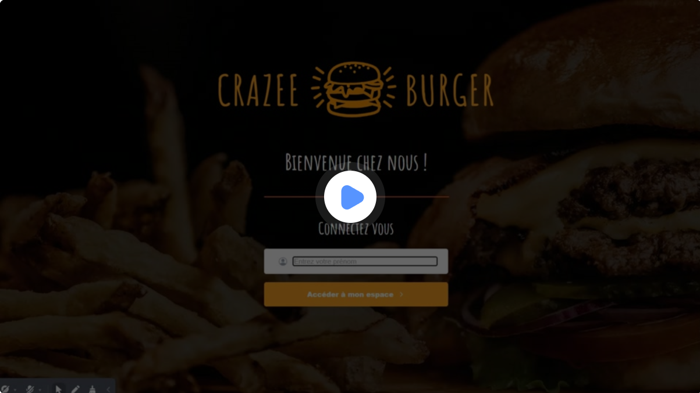
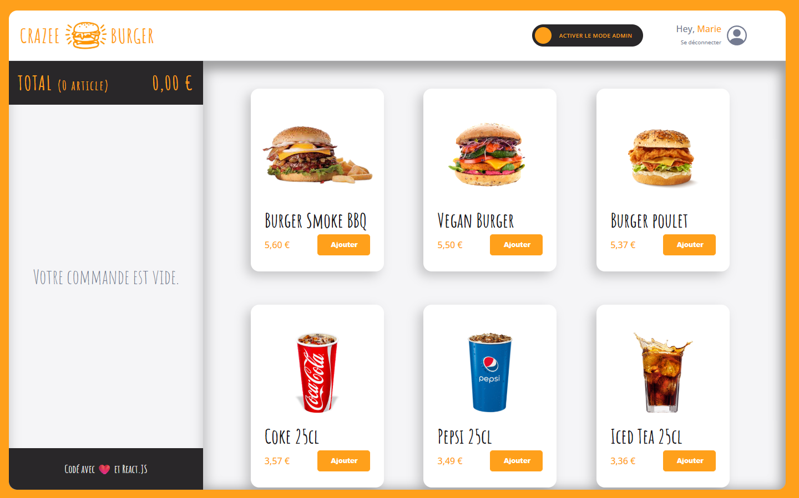
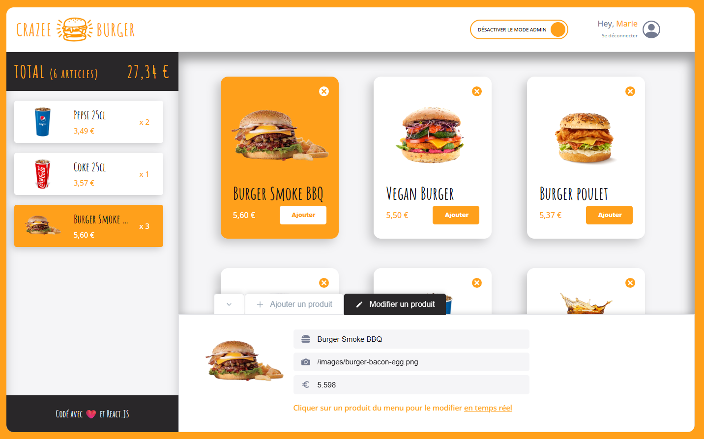

#  Crazee Burger – Application de commande en temps réel

## 🚀 Aperçu du projet

**Crazee Burger** est une application web moderne développée en **React**, permettant aux utilisateurs de :

- consulter la carte des produits,

- créer une commande,

- gérer un panier en **temps réel**,

- utiliser un **panel administrateur** pour ajouter / modifier les produits (CRUD),

- profiter d’une interface fluide, accessible et _responsive (à venir)_.

Ce projet met en avant des **bonnes pratiques front-end**, une architecture claire, une UI cohérente, et un code maintenable.

## 🎓 Contexte

**Ce projet s’inscrit dans une démarche d’autoformation rigoureuse visant :**

- à acquérir les réflexes d’un développeur React opérationnel,

- à maîtriser les outils utilisés en entreprise,

- et à monter en compétence sur les techniques de développement modernes.

Il représente un exemple concret de ma manière de coder, structurer, documenter et organiser un projet, comme je le fais en contexte professionnel.

## 🔹 Crédits et disclaimer

Ce projet est issu de la formation **“React en entreprise”** de **ViDev**.  
Tous les éléments de design, images, noms et maquettes ne m’appartiennent pas et sont la propriété du formateur.  
Cette version sur **GitHub est uniquement à titre démonstratif / visuel (lecture seule)**, pour présenter mon organisation de travail et ma pratique de React. **Le dépôt GitLab privé contient la version complète.**  
Pour découvrir la formation originale : [ViDev - React en entreprise](https://www.videv.fr/react-en-entreprise)
.

## 📷 Aperçu / Démo en ligne

   
 

## ⏳ Progression du projet

**Progression globale : 75%**

🟧🟧🟧🟧🟧🟧🟧⬛⬛⬛

**Légende / Détails des features :**  
🟧 = fonctionnalités terminées   
⬛ = fonctionnalités restantes 

## 🛠️ Technologies utilisées

### Front-end

- ⚛️ React **19**

- 🧭 React Router

- ⚡ Contexte global & hooks personnalisés

- 🎨 **Styled-components**

- 🧩 clsx (gestion des classes)

- 🔄 State Management Local (custom hooks)

- 📦 Vite

- 📦 Yarn

### Back-end / Services

🔥 **Firebase** (_en cours_ — persistance des données côté client)

### DevOps

- 🐳 Docker

- 🧪 GitLab CI (tests + sécurité)

- 🔐 Secret Detection / SAST

- 🔄 Mirroring automatique GitLab → GitHub via SSH (**lecture seule**)

- ▲ Déploiement Vercel

## ⭐ Fonctionnalités déjà développées

### 👤 Authentification

- Page de login

- Interface minimaliste & responsive

- Gestion simple des utilisateurs (mock pour l’instant)

### 🧾 Page de commande

- Affichage dynamique du menu

- Ajout / modification / suppression d’items dans le panier

- Mise à jour en temps réel des quantités & du total

### 🛠️ Panneau Admin

- Ouverture / fermeture du panel

- Formulaire complet de gestion d’un produit

- Modification en **temps réel** sur la fiche produit

- Suppression d’un item avec gestion propre du focus

### 🧩 Composants avancés

- Composant `<Card />` totalement réutilisable

- Gestion des hover, sélection et états actifs

- Hook `useBasketSum` pour calcul dynamique sécurisé

- Toast de notification pour bascule admin

- Scrollbars custom visibles uniquement au survol

## 🧠 Architecture & principes

- **Découpage par features** : F01 → F15

- **Hooks personnalisés** : useMenu, useBasketSum, useAdminPanel…

- **Theming avancé** via styled-components (typographies, couleurs, spacing)

- Code entièrement **typé** (React + JSDoc, _migration TS prévue_)

- Gestion accessible des inputs (ARIA-friendly)

## 📌 Fonctionnalités restantes à implémenter

### 🔥 F13 – Persistance des données (Firebase)

Sauvegarder le menu et les commandes en base temps réel.

### ✨ F14 – Animations sexy !

Utilisation des **keyframes** de styled-components pour :

- transitions du panel admin,

- animations des cards,

- micro-interactions du panier.

### 📢 F15 – Disponibilité & publicité

- Gestion d’un état “disponible / indisponible”

- Ajout d’une zone publicité (bannière dynamique)

### 🐛 B01 – Premier bug à traiter

**LOGIN → La création d’un nouvel utilisateur mène à une page de chargement infinie.**

## 🔒 À propos de ce miroir GitHub

Ce dépôt GitHub est un **miroir en lecture** seule du vrai projet hébergé sur GitLab.

- ❌ Issues : désactivées

- ❌ PR : refusées

- ✔️ Consultation du code : **OK**

- ✔️ Portfolio / vitrine professionnelle : **OK**

## 👩‍💻 Auteur

**Karvaneg** — Développeuse Web Fullstack (React, Twig, Symfony, NodeJS, Express, Docker…)

